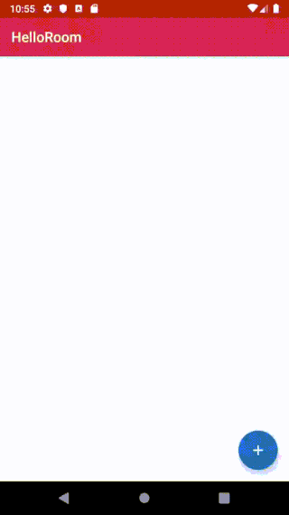

# HelloRoom

Basic Android Room Database Example with Android ReactComponentKit.



## Actions

```kotlin
// Load all words from the DB
object LoadWordsAction: Action

// Insert an word into the DB
data class InsertWordAction(val word: Word): Action

// Delete an word in the DB
data class DeleteWordAction(val word: Word): Action
```

## Reducers

```kotlin
// Load all words from the DB
fun MainViewModel.loadWords(state: State, action: Action): Observable<State> {
    if (action !is LoadWordsAction) { return Observable.just(state) }
    val mainViewState = (state as? MainViewState) ?: return Observable.just(state)

    val words = WordDB.getInstance(getApplication())
        .wordDao()
        .getAlphabetizedWords()

    return Observable.just(mainViewState.copy(words = words))
}

// Insert an word into the DB
fun MainViewModel.insertWord(state: State, action: Action): Observable<State> {
    val act = (action as? InsertWordAction) ?: return Observable.just(state)

    WordDB.getInstance(getApplication())
        .wordDao()
        .insert(act.word)

    nextDispatch(LoadWordsAction)

    return Observable.just(state)
}

// Delete an word in the DB
fun MainViewModel.deleteWord(state: State, action: Action): Observable<State> {
    val act = (action as? DeleteWordAction) ?: return Observable.just(state)

    WordDB.getInstance(getApplication())
        .wordDao()
        .delete(act.word)

    nextDispatch(LoadWordsAction)

    return Observable.just(state)
}
```

## Postwares

```kotlin
// Make ItemModels from word list for the recycler view
fun MainViewModel.makeItemModels(state: State, action: Action): Observable<State> {
    if (action !is LoadWordsAction) { return Observable.just(state) }
    val mainViewState = (state as? MainViewState) ?: return Observable.just(state)
    if (mainViewState.words.isEmpty()) { return Observable.just(state) }

    val itemModels = mainViewState.words.map { WordModel(it) }

    return Observable.just(mainViewState.copy(itemModels = itemModels))
}
```

## State

```kotlin
data class MainViewState(
    val words: List<Word> = emptyList(),
    val itemModels: List<WordModel> = emptyList()
): State()
```

## MainViewModel

```kotlin
class MainViewModel(application: Application): RootAndroidViewModelType<MainViewState>(application) {

    val itemModels = Output<List<WordModel>>(emptyList())

    override fun setupStore() {
        store.set(
            initialState = MainViewState(),
            middlewares = emptyArray(),
            reducers = arrayOf(::loadWords, ::insertWord, ::deleteWord),
            postwares = arrayOf(::makeItemModels)
        )
    }

    operator fun get(index: Int): Word {
        return store.state.words[index]
    }

    override fun on(newState: MainViewState) {
        itemModels.accept(newState.itemModels)
    }

    override fun on(error: Error) {
        Log.e("MainViewModel", error.toString())
    }
}
```

## MainActivity

```kotlin
class MainActivity : AppCompatActivity() {

    private lateinit var viewModel: MainViewModel
    private val disposeBag: AutoDisposeBag by lazy {
        AutoDisposeBag(this)
    }

    private val layoutManager: LinearLayoutManager by lazy {
        LinearLayoutManager(this, RecyclerView.VERTICAL, false)
    }

    private val adapter: RecyclerViewAdapter by lazy {
        RecyclerViewAdapter(token = viewModel.token, useDiff = true)
    }

    private val itemTouchHelper: ItemTouchHelper by lazy {
        ItemTouchHelper(SwipeToDeleteCallback {
            val word = viewModel[it]
            viewModel.dispatch(DeleteWordAction(word))
        })
    }

    override fun onCreate(savedInstanceState: Bundle?) {
        super.onCreate(savedInstanceState)
        setContentView(R.layout.activity_main)
        setSupportActionBar(toolbar)

        viewModel = ViewModelProviders.of(this).get(MainViewModel::class.java)

        adapter.register(WordComponent::class)
        recyclerview.layoutManager = layoutManager
        recyclerview.adapter = adapter
        itemTouchHelper.attachToRecyclerView(recyclerview)

        loadWords()
        handleClickEvents()
        handleViewModelOutputs()
    }

    private fun loadWords() {
        viewModel.dispatch(LoadWordsAction)
    }

    private fun handleClickEvents() {
        fab.onClick {
            val word = Word(WordUtils.randomWord)
            viewModel.dispatch(InsertWordAction(word))
        }
    }

    private fun handleViewModelOutputs() {
        viewModel
            .itemModels
            .asObservable()
            .subscribe {
                adapter.set(it)
            }
            .disposedBy(disposeBag)
    }
}
```

## MIT License

The MIT License (MIT)

Copyright (c) 2019 Sungcheol Kim, [https://github.com/ReactComponentKit/HelloRoom](https://github.com/ReactComponentKit/HelloRoom)

Permission is hereby granted, free of charge, to any person obtaining a copy
of this software and associated documentation files (the "Software"), to deal
in the Software without restriction, including without limitation the rights
to use, copy, modify, merge, publish, distribute, sublicense, and/or sell
copies of the Software, and to permit persons to whom the Software is
furnished to do so, subject to the following conditions:

The above copyright notice and this permission notice shall be included in all
copies or substantial portions of the Software.

THE SOFTWARE IS PROVIDED "AS IS", WITHOUT WARRANTY OF ANY KIND, EXPRESS OR
IMPLIED, INCLUDING BUT NOT LIMITED TO THE WARRANTIES OF MERCHANTABILITY,
FITNESS FOR A PARTICULAR PURPOSE AND NONINFRINGEMENT. IN NO EVENT SHALL THE
AUTHORS OR COPYRIGHT HOLDERS BE LIABLE FOR ANY CLAIM, DAMAGES OR OTHER
LIABILITY, WHETHER IN AN ACTION OF CONTRACT, TORT OR OTHERWISE, ARISING FROM,
OUT OF OR IN CONNECTION WITH THE SOFTWARE OR THE USE OR OTHER DEALINGS IN THE
SOFTWARE.